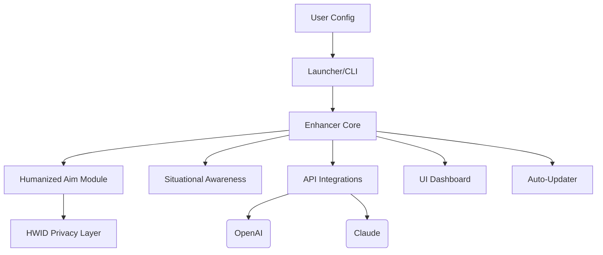

# NextGen-CS2 Enhancer 🌌
> **Redefining the Counter-Strike 2 Experience with Human-Like Precision and Strategic Assistance – The Guardian's Toolkit for Advanced Play.**

---

## 🔥 Introduction: Elevate Your Counter-Strike 2 Journey

Welcome to **NextGen-CS2 Enhancer** – a visionary augmentation suite for Counter-Strike 2 enthusiasts seeking a more personalized, humanized, and strategic gameplay evolution. Inspired by competitive insights and powered by next-generation AI integrations, our platform crafts an immersive user experience facilitating both fair play and ingenious tactical support.

This repository is a creative, ethical toolkit designed for:
- Seamless aim enhancement mimicking authentic human reflexes
- Advanced situational awareness modules (including intelligent smoke/bomb detection overlays)
- Configurable trigger automation empowering your in-game decisions  
- Multi-layered privacy provisions including an innovative hardware identifier veil
- Adaptive updates synchronizing enhancements with every CS2 patch

**Note:** NextGen-CS2 Enhancer is crafted to prioritize competitive enrichment and responsible operation. We do _not_ condone malicious gameplay or exploitative manipulation of Counter-Strike 2 or any digital ecosystem.

---

## ☄️ Fast Access & Download

Looking for the latest build? Tap below to obtain the current installer (and check back regularly for the latest version!):

---

## 🏆 Feature List

- **Humanized Aim Assist**: AI-driven aiming calibration—smooth yet unpredictable, tailored to avoid machine-like behaviors.
- **Situational Awareness Tools**: Real-time overlays for targets, environment anomalies (smokes, flashes, bomb sites), and strategic drop detection.
- **Trigger Action Customization**: Conditional response automation on weapon, environment, or player status.
- **Hardware Disguise Mechanism**: Proprietary HW ID masking for competitive privacy.
- **Continuous Smart Updates**: Auto-sync with CS2 updates—no manual patching required!
- **OpenAI and Claude API Integration**: Predictive analytics and gameplay suggestions, along with bot-powered multilingual in-game assistance.
- **Responsive, Thematic UI**: Modern interface, dark-mode support, and mobile dashboard compatibility.
- **Global Multilingual Support**: Comprehensive translation for 21+ languages.
- **Always-On (24/7) Support**: Community-driven help network with guaranteed human (and AI) support.

---

## 👾 Example Profile Configuration (`config.example.json`)

An example of crafting your personalized enhancer profile:

{
  "aimEnhancer": {
    "mode": "humanized",
    "sensitivityCurve": 0.87,
    "randomnessFactor": 0.23,
    "hotkey": "mouse5"
  },
  "situationalAwareness": {
    "overlayColor": "#FF5733",
    "showSmoke": true,
    "showBomb": true,
    "opacity": 0.8
  },
  "apiIntegrations": {
    "openaiAPIKey": "YOUR-OPENAI-KEY-HERE",
    "claudeAPIKey": "YOUR-CLAUDE-KEY-HERE"
  },
  "language": "fr",
  "privacyMode": true
}

📝 *Tweak, personalize, and optimize to suit your strategy and comfort.*

---

## 🧑‍💻 Example Console Invocation

Launching the enhancer via CLI for ultimate control:

bash
$ nextgen-cs2-enhancer --profile ~/cs2configs/myprofile.json --safe-mode --enable-ui

_Pro tip: Utilize `--update` to trigger real-time update checks!_

---

## 🎯 SEO-Friendly Advantages

Elevate your CS2 play with:
- Humanized aim enhancement for competitive edge
- Strategic overlays to dominate any scenario
- Automated actions for ultra-responsive gameplay
- Always current with zero interruption, thanks to auto-updates
- Multilingual, AI-powered guidance for global players
- Hardware-privacy for secure, anxiety-free sessions

_Achieve the next level and join the innovative CS2 community advancing play through technology._

---

## 🤖 API Integration: OpenAI & Claude

Harness cutting-edge analytics and bot-assisted gameplay! Integrate your OpenAI or Claude API keys directly in configuration:

- **Strategic Suggestions:** AI recommends plays based on real-time enemy movement and map events.
- **Custom Triggers:** Use LLM-powered scripting for smart conditions
- **Live Translation & Assistant:** Get in-game chat translations, strategy tips, and context-aware feedback.

---

## 🌍 OS Compatibility Matrix

| Platform                    | Supported | UI Native | CLI Interface | API Modules |
|-----------------------------|:---------:|:---------:|:-------------:|:-----------:|
|  | ✅       | ✅        | ✅           | ✅          |
|     | ✅       | ✅        | ✅           | ✅          |
|  | ✅   | ✅        | ✅           | ✅          |

---

## 🌠 Mermaid Architecture Overview

Here's a visual sketch of our modular system:

---

## 🧷 License (MIT)

Use and build upon this toolkit under the MIT license:

---

## ⚠️ Disclaimer (2026)

**Use Responsibly!**
> NextGen-CS2 Enhancer is intended **exclusively for educational, research, or personal self-improvement purposes**. The creators bear zero liability for any misuse, non-compliance with local game policies or TOS, or ethical violations. The software never encourages unfair play or disruptive behavior. Always comply with the Counter-Strike 2 Community Guidelines. By using this project, you acknowledge and accept these conditions.

---

## 📲 Wrapping Up & Download

Access the latest release and begin your enhanced journey:

---

*2026 📡 — NextGen-CS2 Enhancer: Your All-Seeing, Human-Perfected CS2 Companion.*